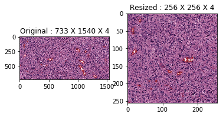
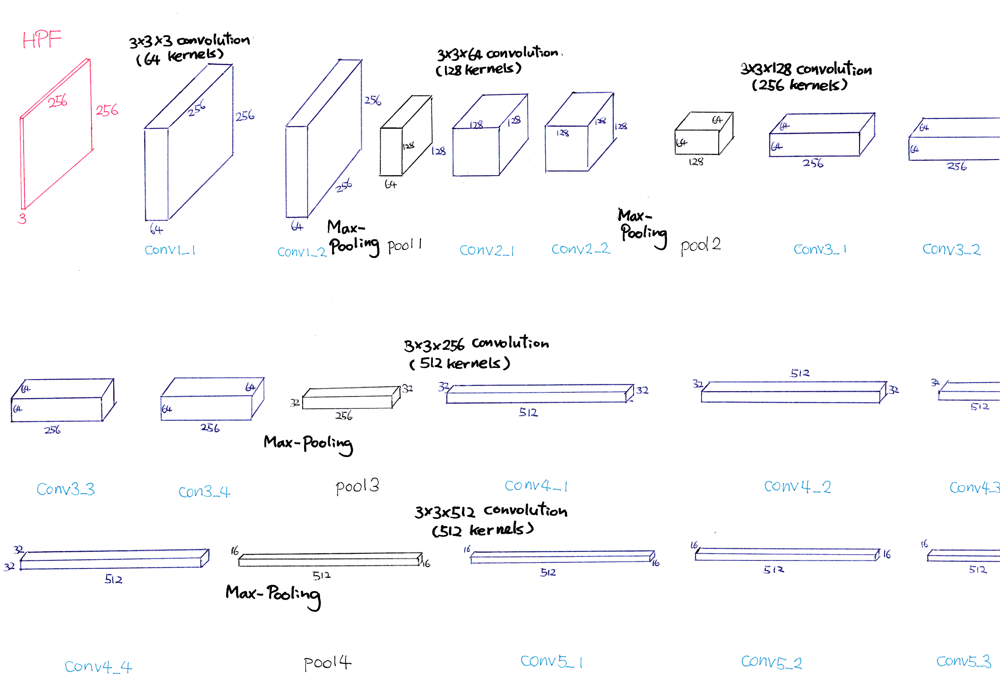
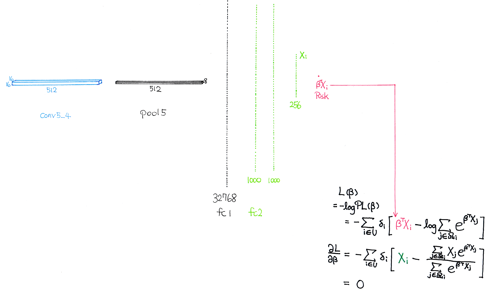

## Predicting cancer outcomes from histology and genomics using convolutional networks  
I try to emulate the SCNN algorithm from Mobadersany, P.*et al* (2018)  
<http://www.pnas.org/content/early/2018/03/09/1717139115>  
However, this is NOT the official repository of this paper.  
The official repository is:  
<https://github.com/CancerDataScience/SCNN>  
---------------------------------------------------------------
In this model, the dimension of images is 256 by 256. TCGA-GBM images are resized as below.  
  
Images below are their modification of VGG-19  

